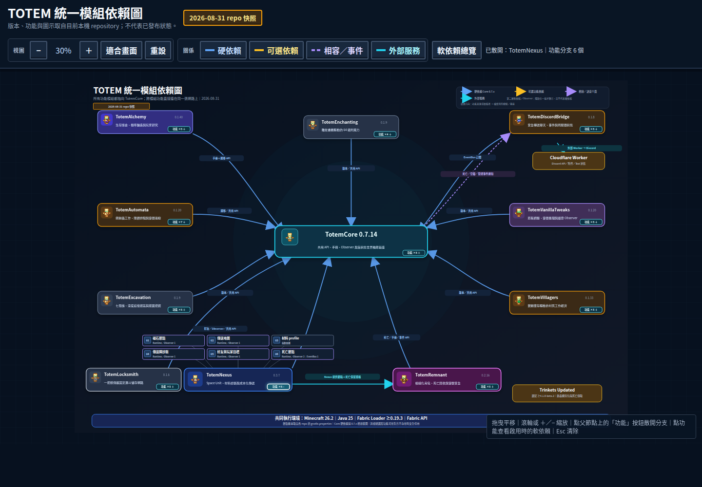

# TotemWorkspace

TotemWorkspace 是 11 個現役 Totem 模組的公開協作與文件總表。這裡集中保存模組版本快照、依賴契約、開發規範、發布檢查表，以及可互動的統一功能／依賴圖；本 repository 本身不是 Minecraft 模組。

目前快照日期為 **2026-09-02**。本次整理 11 個現役模組的正式版本，補齊 Totem 物品配方取得進度、Alchemy 可切換的釀造材料自動登錄，以及 Remnant 回聲碎片結晶途徑；curated 互動圖共有 **58 個**可展開功能分支。

[開啟 GitHub Pages 互動式模組圖](https://yunitrish006006.github.io/TotemWorkspace/)
｜[Curated HTML](index.html)
｜[V2 3D 圖](graph-v2.html)
｜[Flutter Viewer Roadmap](docs/flutter-viewer-roadmap.md)

`index.html` 目前仍是經驗證的 curated 架構來源。V2 則拆成純 renderer 與獨立 generated data：`graph-v2.html` 本身不保存任何 module／feature／contract／code-index 資料；資料只存在 `viewer/generated/graph-data.js`，並由同一套 validated knowledge + 本機 code index 產生，因此不建立第三份人工 dependency graph。



## 快速連結

- [模組總表](docs/module-catalog.md)
- [依賴與軟整合契約](docs/dependency-contracts.md)
- [開發注意事項](docs/development-guidelines.md)
- [Codex Workspace Intelligence](docs/codex-intelligence.md)
- [Flutter Viewer Migration](docs/flutter-viewer-roadmap.md)
- [發布檢查表](docs/release-checklist.md)
- [目前原始碼狀態](docs/current-status.md)
- [機器可讀快照](data/modules.json)

## Codex Workspace Intelligence

本 repository 同時提供一層給 Codex／CodexDiscord 使用的 **graph-first workspace RAG**。它不另外維護第三份依賴圖，而是直接從已驗證的 `index.html` 與 `data/modules.json` 導出 11 個模組、58 個功能分支、硬依賴、Fabric `suggests`、runtime optional、EventBus、外部服務與 Observer provider 關係。

V1 使用本機 lexical／symbol code index，不需要 embedding、向量資料庫或外部 API。主模型可先用 MCP 的 `resolve_task` 與 `context_pack` 縮小模組與契約範圍，再把 implementation、探索與 review 分配給 bounded subagents；修改後使用 `impact` 與 `test_plan` 決定需回看哪些 sibling modules。

```sh
node scripts/totem-intelligence.mjs resolve "死亡背包跟 Nexus 同步有問題"
node scripts/totem-intelligence.mjs build-index
node scripts/totem-intelligence.mjs context "銅魁儡背包防巢狀" primary
```

本機 index 只寫入 `.totem-index/`，不進 Git。MCP、Codex Skill、CodexDiscord 設定方式見 [Codex Workspace Intelligence](docs/codex-intelligence.md)。

## 自動 V2 3D 架構圖

V2 現在是 standalone 3D viewer；舊 2D renderer 已移除：

```text
graph-v2.html                       # 純 HTML shell，沒有架構資料
viewer/graph-v2.css                 # 畫面樣式
viewer/graph-v2-adapter.js          # architecture-only fallback adapter
viewer/graph-v2-cluster-v2.js       # standalone 3D renderer
viewer/local-live.js                # localhost live workspace adapter；Pages 上自動停用
viewer/generated/graph-data.js      # JS viewer 的自動 generated data
```

資料層再分成：

- **Curated 層**：11 modules、58 features、32 contracts，仍由原有驗證過的 Workspace 資料決定。
- **Generated code-detail 層**：由 `.totem-index` 中實際存在的 file path、test file、symbol 名稱產生；不包含 source body，也不能新增或改寫 dependency contract。
- **3D standalone viewer**：Core 固定在世界中心；展開 cluster 使用 deterministic relation-aware placement，並支援精確 feature/capability endpoint、線條類型篩選、spotlight、桌機與觸控操作。
- **Local live mode**：`node scripts/serve-local-viewer.mjs` 只綁 `127.0.0.1`，可顯示 sibling repos 的 branch / HEAD / dirty / snapshot drift，並做增量 index + graph refresh。

一般修改完成後的流程：

```text
implementation
  -> impact
      -> incremental RAG refresh
      -> regenerate viewer/generated/graph-data.js (best effort)
  -> test_plan
  -> reviewer
  -> Gradle / GameTest
```

正常 code/architecture 資料更新不會改寫 HTML、CSS 或 renderer JS。需要手動重建 generated data 時：

```sh
node scripts/totem-intelligence.mjs render-graph
```

如果 V2 data generation 失敗，只會回報 warning；不能讓原本成功的 `impact` 或 code-index refresh 失敗。

## Flutter Viewer Migration

`viewer_flutter/` 是下一代 viewer 的並行 migration prototype；在 feature parity 完成前不取代目前 production JavaScript viewer。

Flutter 不維護自己的 architecture graph。`scripts/render-flutter-graph.mjs` 直接呼叫同一個 `buildGraphViewModel()`，輸出 `viewer_flutter/assets/graph-data.json`，確保 JS 與 Flutter renderer 使用相同語意來源。

Phase 1 本機執行：

```sh
node scripts/render-flutter-graph.mjs
cd viewer_flutter
flutter pub get
flutter run -d chrome
```

WebAssembly build：

```sh
flutter build web --wasm
```

目前 CI 固定 Flutter 3.47.0，驗證 analyze、unit tests 與 Web/Wasm build。完整 migration 階段與 production cutover 條件見 [Flutter Viewer Migration Roadmap](docs/flutter-viewer-roadmap.md)。

## 資料更新原則

各功能、畫面與 API 仍由原本的 11 個模組 repository 擁有；本 repository 只統整跨模組事實。版本、預設分支、完整 commit SHA、Fabric 依賴範圍與 Observer protocol 必須從擁有者 repository 重新核對後更新。`current-status.md` 與 `modules.json` 以原始碼快照為主；若另記 CI／Modrinth 狀態，必須附上獨立查驗證據，不從版本號推論。

自動生成的 V2 code-detail 節點只代表「索引確實看到這個檔案／symbol」，不代表新的架構所有權或模組依賴。DeadRecall 已停止維護；僅保留為相容性歷史背景，不列入現役模組或依賴圖。

## 本機驗證

```sh
node scripts/validate-workspace.mjs
node scripts/validate-intelligence.mjs
```

驗證器不需要安裝 npm 套件，支援 Node.js 20.19+；GitHub Actions 同時驗證 Node.js 20.19.4 與 Node.js 22。Flutter viewer 另由 `.github/workflows/flutter-viewer.yml` 驗證。
